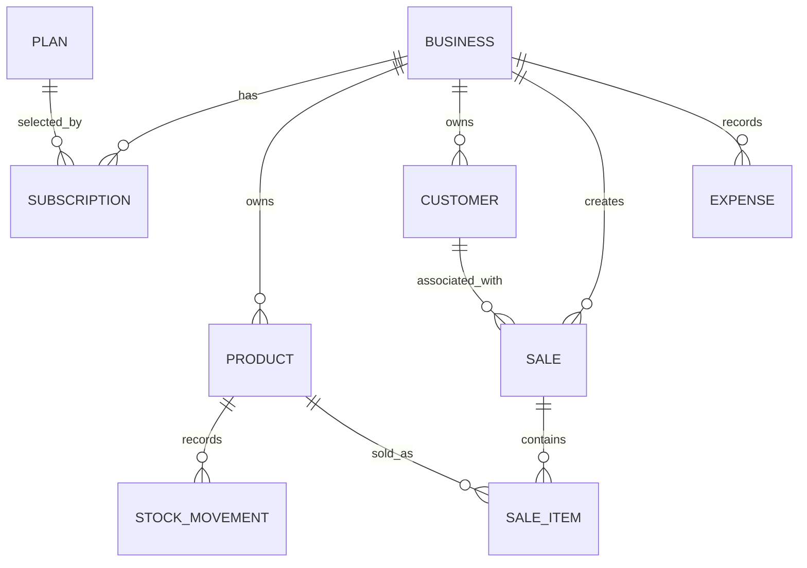

# Backend Documentation

## 1. Overview

The backend is a NestJS application for Feqqa, a business-management system. The implemented backend currently provides:

- Business registration, email OTP verification, and JWT login.
- Business profile lookup.
- Subscription plan selection and subscription read/delete operations.
- Plan CRUD operations.
- Product and stock management.
- Customer and receivables management.
- Expense recording and monthly summaries.
- Sale creation with inventory deduction and customer debt updates.
- Authenticated data aggregation for sales, inventory, receivables, expenses, and historical cash flow.
- Image upload to Cloudinary.
- Swagger/OpenAPI documentation.

The application is organized as a modular NestJS monolith. Controllers expose HTTP endpoints, services contain business logic, TypeORM repositories persist PostgreSQL entities, and common infrastructure provides JWT validation, password hashing, validation, and response transformation.

### Architecture at a glance

```text
Client
  |
  v
NestJS controller
  |
  +--> AuthGuard for protected routes
  +--> Global ValidationPipe for DTO validation/transformation
  |
  v
Application service
  |
  v
TypeORM repository or transaction QueryRunner
  |
  v
PostgreSQL

External flows:
  AuthService --> Nodemailer SMTP
  UploadsService --> Cloudinary
```

There is no global API prefix. Routes include their `/api/...` prefix directly in controller decorators.

## 2. Technology Stack

| Technology | Purpose |
|---|---|
| NestJS 11 | Backend framework and dependency-injection architecture |
| TypeScript | Application language |
| Node.js | Runtime; production starts `dist/main` |
| Express platform adapter | HTTP server integration through `@nestjs/platform-express` |
| PostgreSQL | Relational database |
| TypeORM | ORM, repositories, entities, and transactions |
| `@nestjs/jwt` / JWT | Access-token signing and verification |
| `bcrypt` | Password hashing and comparison in `AuthService` |
| `bcryptjs` | Password hashing through the shared `HashingService` |
| `class-validator` | DTO validation decorators |
| `class-transformer` | DTO transformation and nested request handling |
| Swagger / OpenAPI | Interactive API documentation at `/api/docs` |
| Jest and Supertest | Unit and end-to-end test tooling |
| Nodemailer | SMTP delivery of verification OTP emails |
| Cloudinary | Remote image/file storage |
| Multer and Streamifier | Multipart file interception and streaming buffers to Cloudinary |
| RxJS | Nest interceptor response mapping |

Declared dependencies such as `axios`, Passport JWT typings, and `@nestjs/mapped-types` are not used directly in the backend source. `PartialType` is imported from `@nestjs/swagger`.

## 3. Project Structure

The backend is located in `feqqa-backend/`.

```text
feqqa-backend/
├── .env
├── .gitignore
├── .prettierrc
├── eslint.config.mjs
├── nest-cli.json
├── package.json
├── package-lock.json
├── README.md
├── tsconfig.json
├── tsconfig.build.json
├── src/
│   ├── main.ts
│   ├── app.controller.ts
│   ├── app.controller.spec.ts
│   ├── app.module.ts
│   ├── app.service.ts
│   ├── common/
│   │   ├── common.module.ts
│   │   ├── decorators/
│   │   │   ├── current-user.decorator.ts
│   │   │   └── user-role.decorator.ts
│   │   ├── guards/
│   │   │   ├── auth.guard.ts
│   │   │   ├── auth-role.guard.ts
│   │   │   └── subscription.guard.ts
│   │   ├── interceptors/
│   │   │   └── transform.interceptor.ts
│   │   └── services/
│   │       └── hashing.service.ts
│   ├── config/
│   │   └── database.config.ts
│   └── modules/
│       ├── auth/
│       ├── businesses/
│       ├── subscriptions/
│       ├── plans/
│       ├── sales/
│       ├── products/
│       ├── customers/
│       ├── expenses/
│       ├── ai-data/
│       ├── uploads/
│       └── notifications/
└── test/
    ├── app.e2e-spec.ts
    └── jest-e2e.json
```

### Folder responsibilities

- `src/main.ts`: Creates the Nest application, registers global validation and response transformation, configures Swagger, and listens on `PORT` or `3000`.
- `src/app.module.ts`: Root module. Loads configuration, configures TypeORM, and imports all feature modules.
- `src/common/`: Shared JWT guard, current-user decorator, password hashing service, response interceptor, and role/subscription guard scaffolding.
- `src/config/`: Active PostgreSQL TypeORM configuration.
- `src/modules/auth/`: Registration, OTP verification, login, and authentication DTOs.
- `src/modules/businesses/`: Business profile entity, repository access, registration persistence, and current-business lookup.
- `src/modules/subscriptions/`: Plan selection, subscription reads, deletion, and active-subscription checks.
- `src/modules/plans/`: Subscription plan CRUD and active-plan lookup.
- `src/modules/products/`: Product records, stock levels, and stock movement history.
- `src/modules/customers/`: Customer records, receivables, and customer sales relations.
- `src/modules/expenses/`: Expense records and monthly aggregation.
- `src/modules/sales/`: Transactional sale creation, sale items, inventory deduction, and debt updates.
- `src/modules/ai-data/`: Authenticated, read-only business metrics aggregation for AI/dashboard consumers. No AI model call is implemented here.
- `src/modules/uploads/`: Authenticated multipart upload and Cloudinary integration.
- `src/modules/notifications/`: SMTP email service used by authentication.
- `src/test/` and `src/*.spec.ts`: Jest unit and e2e test configuration/files.
- `dist/` and `node_modules/`: Generated/build and dependency artifacts; they are not source-of-truth implementation directories.

## 4. Architecture

### Request flow

```text
HTTP request
  |
  v
Controller route
  |
  +--> AuthGuard on protected controllers/routes
  +--> Global ValidationPipe
  |      whitelist: true
  |      forbidNonWhitelisted: true
  |      transform: true
  |
  v
Service
  |
  +--> TypeORM repository
  +--> QueryRunner transaction for sales/stock updates
  +--> SMTP or Cloudinary integration where applicable
  |
  v
Successful result
  |
  v
Global TransformInterceptor
  |
  v
{ success, statusCode, message, data }
```

### Layers

- **Controllers** map HTTP methods and paths to application services. They also attach Swagger metadata and, for protected routes, `AuthGuard`.
- **DTOs** describe and validate request bodies/query values. The global `ValidationPipe` removes no fields silently: unknown fields cause a validation error because `forbidNonWhitelisted` is enabled.
- **Guards** currently provide bearer JWT authentication. `ActiveSubscriptionGuard` exists but is not attached to routes. Role guard code is commented out.
- **Services** implement registration, authentication, CRUD, aggregation, and transactional business behavior.
- **TypeORM entities/repositories** map application records to PostgreSQL tables. `autoLoadEntities` discovers the entities from registered feature modules.
- **Interceptor** wraps successful controller results. Nest’s default exception handling remains responsible for error responses because no global exception filter is registered.

## 5. Modules

### 5.1 Auth module

- **Responsibility:** Business registration, OTP email verification, password verification, and JWT access-token creation.
- **Controller:** `AuthController` at `/api/auth`.
- **Service:** `AuthService`.
- **Entities:** Uses `Business` through `BusinessesModule` and TypeORM.
- **DTOs:** `RegisterDto`, `VerifyOtpDto`, `LoginDto`.
- **Guards:** None on auth endpoints; it provides authentication for other modules through `CommonModule`.
- **Important dependencies:** `JwtService`, `BusinessesService`, `EmailService`, `bcrypt`.
- **Business logic:** Registration hashes the password through `BusinessesService`, creates a ten-minute six-digit OTP, persists the business, and sends the OTP. Verification marks email verification complete and changes onboarding to `SELECT_PLAN`. Login compares the password and signs a JWT after verification.

### 5.2 Businesses module

- **Responsibility:** Business account persistence and current-business lookup.
- **Controller:** `BusinessesController` at `/api/businesses`.
- **Service:** `BusinessesService`.
- **Entities:** `Business`.
- **DTOs:** Reuses `RegisterDto` from Auth.
- **Guards:** `AuthGuard` on `GET /api/businesses/me`.
- **Important dependencies:** TypeORM repository and `HashingService`.
- **Business logic:** Enforces unique phone/email lookup before registration, hashes passwords with bcryptjs through `HashingService`, stores OTP data, and updates verification/onboarding state.

### 5.3 Plans module

- **Responsibility:** Subscription-plan CRUD and active-plan discovery.
- **Controller:** `PlansController` at `/api/plans`.
- **Service:** `PlansService`.
- **Entities:** `Plan`.
- **DTOs:** `CreatePlanDto`, `UpdatePlanDto`.
- **Guards:** None are applied. The controller comments describe some routes as admin-only, but no active authorization guard enforces that.
- **Important dependencies:** TypeORM repository.
- **Business logic:** Plan codes are checked for duplicates on create and code changes. Active plans are filtered by `is_active`. Plan status is toggled by negating the current value.

### 5.4 Subscriptions module

- **Responsibility:** Selecting a plan, retrieving subscriptions, deleting subscriptions, and checking active expiry.
- **Controller:** `SubscriptionsController` at `/api/subscriptions`.
- **Service:** `SubscriptionsService`.
- **Entities:** `Subscription` and related `Business` and `Plan`.
- **DTOs:** `SelectPlanDto`.
- **Guards:** `AuthGuard` applies to the whole controller. `ActiveSubscriptionGuard` is not applied.
- **Important dependencies:** `BusinessesService`, `PlansService`, TypeORM.
- **Business logic:** A zero-price plan creates an active subscription, calculates expiry from `duration_days`, and completes onboarding. A paid plan changes onboarding to `PENDING_PAYMENT`; no payment provider or payment completion endpoint is implemented.

### 5.5 Products module

- **Responsibility:** Product CRUD-like operations, inventory quantities, low-stock queries, and stock movement history.
- **Controller:** `ProductsController` at `/api/products`.
- **Service:** `ProductsService`.
- **Entities:** `Product`, `StockMovement`.
- **DTOs:** `CreateProductDto`, `UpdateProductDto`.
- **Guards:** `AuthGuard` applies to the whole controller.
- **Important dependencies:** TypeORM repository and `DataSource` for stock transactions.
- **Business logic:** Product lists and low-stock queries are scoped by the JWT business ID. Product creation logs an initial adjustment when initial stock is positive. Stock updates use a database transaction and log an adjustment movement.

### 5.6 Customers module

- **Responsibility:** Customer creation, business-scoped lists, receivables, and sales history.
- **Controller:** `CustomersController` at `/api/customers`.
- **Service:** `CustomersService`.
- **Entities:** `Customer`, related to `Business` and `Sale`.
- **DTOs:** `CreateCustomerDto`.
- **Guards:** `AuthGuard` applies to the whole controller.
- **Important dependencies:** TypeORM repository.
- **Business logic:** Lists and receivables are filtered by business. Receivables return customer identity, phone, amount, and `EGP` currency. Single-customer lookup loads sales but is queried by customer ID without a business predicate.

### 5.7 Expenses module

- **Responsibility:** Expense recording, history, and monthly category totals.
- **Controller:** `ExpensesController` at `/api/expenses`.
- **Service:** `ExpensesService`.
- **Entities:** `Expense`.
- **DTOs:** `CreateExpenseDto`.
- **Guards:** `AuthGuard` applies to the whole controller.
- **Important dependencies:** TypeORM `Between` date filtering.
- **Business logic:** Expenses are stored against the authenticated business, listed newest first, and summarized by month with total and category amounts in EGP.

### 5.8 Sales module

- **Responsibility:** Sale transaction creation, sale-item persistence, stock deduction, movement logging, and customer-debt updates.
- **Controller:** `SalesController` at `/api/sales`.
- **Service:** `SalesService`.
- **Entities:** `Sale`, `SaleItem`, `Product`, `StockMovement`, `Customer`.
- **DTOs:** `CreateSaleDto` with nested sale items.
- **Guards:** `AuthGuard` applies to the controller.
- **Important dependencies:** TypeORM `DataSource` and QueryRunner transaction.
- **Business logic:** Product existence is checked for the authenticated business before the sale is saved. The service calculates totals from submitted item quantity and unit price, creates the sale/items, decrements stock, logs movements, and adds remaining balance to customer debt.

### 5.9 AI data module

- **Responsibility:** Read-only, authenticated aggregation endpoints used by the dashboard/AI integration layer.
- **Controller:** `AiDataController` at `/api/ai-data`.
- **Service:** `AiDataService`.
- **Entities:** Reads `Sale`; delegates products, customers, and expenses to their services.
- **DTOs:** `GetSalesQueryDto`, `GetExpensesQueryDto`.
- **Guards:** `AuthGuard` applies to the whole controller.
- **Important dependencies:** Sales repository, `ProductsService`, `CustomersService`, `ExpensesService`.
- **Business logic:** Provides totals and summaries only. No LLM, model provider, or outbound AI API call is present in this module.

### 5.10 Uploads module

- **Responsibility:** Authenticated multipart image/file upload to Cloudinary.
- **Controller:** `UploadsController` at `/api/uploads`.
- **Service:** `UploadsService`.
- **Entities/DTOs:** No persistence entity or DTO; Multer handles the multipart file.
- **Guards:** `AuthGuard` applies to the controller.
- **Important dependencies:** `FileInterceptor`, Cloudinary SDK, Streamifier.
- **Business logic:** Accepts a `file` field, limits the file buffer to 5 MiB, streams it to `feqqa/<folder>`, and returns the Cloudinary secure URL.

### 5.11 Notifications module

- **Responsibility:** SMTP delivery of registration and re-verification OTP emails.
- **Controller:** None.
- **Service:** `EmailService`.
- **Entities/DTOs/Guards:** None.
- **Important dependencies:** Nodemailer and SMTP environment variables.
- **Business logic:** Creates one SMTP transporter and sends an HTML email. Failures are logged and return `false`; the authentication service does not inspect that return value before completing its response path.

## 6. Database Design

### Database technology and ORM

- **Database:** PostgreSQL.
- **ORM:** TypeORM.
- **Connection:** `DATABASE_URL` is used by the active configuration.
- **Entity loading:** `autoLoadEntities: true`.
- **Schema management:** `synchronize: true`; no migration or seed files were found.
- **TLS:** SSL is enabled with `rejectUnauthorized: false`.

### Entities and relationships

| Entity/table | Primary key | Important columns | Relationships |
|---|---|---|---|
| `Business` / `businesses` | UUID `id` | phone, email, role, business details, password hash, verification state, onboarding state, timestamps | One business has many subscriptions, products, customers, expenses, and sales through owning-side relations |
| `Plan` / `plans` | UUID `id` | unique code, name, decimal price, duration, limits, feature flags, active flag, timestamps | A plan is referenced by subscriptions |
| `Subscription` / `subscriptions` | UUID `id` | status enum, start and expiry timestamps, created timestamp | Many subscriptions belong to one business; each references one plan |
| `Product` / `products` | UUID `id` | name, URLs/category/SKU, decimal prices, stock, minimum stock, expiry, timestamps | Many products belong to one business; one product has many stock movements |
| `StockMovement` / `stock_movements` | UUID `id` | movement enum, quantity change, resulting stock, optional reference ID, created timestamp | Many movements belong to one product |
| `Customer` / `customers` | UUID `id` | name, phone, decimal total debt, timestamps | Many customers belong to one business; one customer has many sales |
| `Sale` / `sales` | UUID `id` | decimal totals, payment status enum, created timestamp | Many sales belong to one business; an optional customer belongs to a sale; a sale has many sale items |
| `SaleItem` / `sale_items` | UUID `id` | quantity, decimal unit/total prices | Many sale items belong to one sale and reference one product |
| `Expense` / `expenses` | UUID `id` | decimal amount, category, date, description, receipt URL, timestamps | Many expenses belong to one business |

### Keys, constraints, and indexes

- All entity primary keys are UUIDs generated by TypeORM.
- Unique constraints exist on `Business.phone`, nullable `Business.email`, and `Plan.code`.
- Foreign-key delete behavior includes business-owned records cascading from `Business`, stock movements cascading from `Product`, sale items cascading from `Sale`, and sale customer references being set to null when a customer is deleted.
- No explicit indexes beyond unique constraints were found.
- No explicit database check constraints were found for non-negative stock, payment consistency, or date ordering.

### Enum fields

- `Business.role`: `USER`, `ADMIN`, `SUPER_ADMIN`.
- `Business.onboarding_status`: `VERIFY_EMAIL`, `SELECT_PLAN`, `PENDING_PAYMENT`, `COMPLETED`.
- `Subscription.status`: `ACTIVE`, `EXPIRED`, `CANCELLED`, `PENDING_PAYMENT`.
- `Plan` package type enum exists in utilities but is not a column in the `Plan` entity.
- `StockMovement.type`: `SALE`, `PURCHASE`, `RETURN`, `ADJUSTMENT`.
- `Sale.payment_status`: `FULL`, `PARTIAL`, `UNPAID`.

### ER diagram



The `Business` to product/customer/sale/expense relationships are represented by owning-side `ManyToOne` foreign keys in those entities. The reverse collection properties are not present on `Business` for every relation, but the database ownership is explicit in the owning entities.

## 7. API Documentation

### Response envelope

Successful responses pass through `TransformInterceptor` and normally have this shape:

```json
{
  "success": true,
  "statusCode": 200,
  "message": "Operation completed successfully",
  "data": {}
}
```

For `POST` requests the default message is `Resource created successfully`. If the service returns an object containing `message` and/or `data`, the interceptor uses those values. Error responses are not wrapped by this interceptor and use Nest’s default exception format.

The examples below show the service payload inside `data`; the outer envelope is applied to successful responses.

### `GET /`

**Purpose:** Return the backend welcome message.

**Authentication:** Not required.

**Authorization:** None.

**Request Parameters:** None.

**Request Body:** None.

**Response:**

```json
{
  "message": "Welcome to Feqqa Backend API!"
}
```

**Possible Status Codes:** `200` successful response.

### `GET /api/docs`

**Purpose:** Serve the Swagger UI generated at application startup.

**Authentication:** Not required by the application setup.

**Authorization:** None.

**Request Parameters:** Swagger UI asset/query parameters may be used by the UI; no application DTO is defined.

**Request Body:** None.

**Response:** Swagger UI/OpenAPI documentation.

**Possible Status Codes:** `200` when the documentation UI is served.

### `POST /api/auth/register`

**Purpose:** Create a business account and send an email verification OTP.

**Authentication:** Not required.

**Authorization:** None.

**Request Parameters:** None.

**Request Body:**

```json
{
  "business_name": "Smart Tech LLC",
  "business_type": "Retail",
  "email": "info@techcompany.com",
  "phone": "+201012345678",
  "password": "P@ssword123",
  "governorate": "Cairo",
  "address": "12 El-Tahrir Street, Dokki"
}
```

`email` must be valid; `phone` must be an Egyptian phone number; password length is 8-32 characters and must contain uppercase, lowercase, and a number or special character. String fields configured with `@Transform` are trimmed; email is lowercased.

**Response:**

```json
{
  "message": "Account created successfully. Please activate your email",
  "business_id": "uuid",
  "email": "info@techcompany.com",
  "dev_otp": "123456"
}
```

**Possible Status Codes:** `201` created; `400` DTO validation failure; `409` phone or email already exists; persistence or email failures may produce a server error according to Nest/provider behavior.

### `POST /api/auth/verify-email`

**Purpose:** Validate the stored OTP, mark the email verified, move onboarding to `SELECT_PLAN`, and return a JWT.

**Authentication:** Not required.

**Authorization:** None.

**Request Parameters:** None.

**Request Body:**

```json
{
  "email": "ahmed@feqqa.app",
  "otp": "123456"
}
```

The DTO requires an email and a six-character string. The service additionally checks account existence, verification state, exact OTP, and ten-minute expiry. It does not enforce numeric-only OTP characters.

**Response:**

```json
{
  "accessToken": "<jwt>",
  "business": {
    "id": "uuid",
    "name": "Smart Tech LLC",
    "email": "info@techcompany.com",
    "phone": "+201012345678",
    "onboarding_status": "SELECT_PLAN"
  }
}
```

**Possible Status Codes:** `200` verified; `400` invalid, expired, already-used, or already-verified OTP/account state; `422` or `400` can be produced by validation depending on Nest’s validation response setup, but the controller documents invalid input as `400`.

### `POST /api/auth/login`

**Purpose:** Authenticate a business by email and password and return an access token.

**Authentication:** Not required.

**Authorization:** None.

**Request Parameters:** None.

**Request Body:**

```json
{
  "email": "user@example.com",
  "password": "Password123!"
}
```

**Response:**

```json
{
  "accessToken": "<jwt>",
  "business": {
    "id": "uuid",
    "name": "Smart Tech LLC",
    "email": "user@example.com",
    "phone": "+201012345678",
    "onboarding_status": "COMPLETED"
  }
}
```

For an unverified account, the service generates and emails a new OTP, then rejects the login with a response object containing `dev_otp`.

**Possible Status Codes:** `200` authenticated; `400` DTO validation failure; `401` missing account, missing password hash, or invalid password; `403` email not verified. The service also exposes the generated development OTP in these auth responses.

### `GET /api/businesses/me`

**Purpose:** Retrieve the authenticated business record.

**Authentication:** Required: `Authorization: Bearer <jwt>`.

**Authorization:** Any valid JWT; no role check.

**Request Parameters:** None.

**Request Body:** None.

**Response:** The `Business` entity, including persisted business fields and timestamps. The entity contains `password_hash` and verification fields in its model; the service does not define a response DTO that removes them.

**Possible Status Codes:** `200`; `401` missing/malformed/invalid token; `404` account does not exist.

### `POST /api/subscriptions/select-plan`

**Purpose:** Select a plan during onboarding. Free plans are activated; paid plans set onboarding to pending payment.

**Authentication:** Required.

**Authorization:** Any valid JWT; no role or payment authorization is applied.

**Request Parameters:** None.

**Request Body:**

```json
{
  "planId": "a1b2c3d4-0000-0000-0000-123456789abc"
}
```

**Response:** Free plan:

```json
{
  "message": "Free plan activated successfully",
  "status": "COMPLETED"
}
```

Paid plan:

```json
{
  "message": "Plan selected. Please proceed to payment",
  "status": "PENDING_PAYMENT",
  "amount": 599
}
```

**Possible Status Codes:** `200`; `400` validation failure; `401` invalid token; `404` business or plan not found.

### `GET /api/subscriptions/me`

**Purpose:** Retrieve the latest active subscription for the authenticated business.

**Authentication:** Required.

**Authorization:** Any valid JWT; ownership is taken from the JWT.

**Request Parameters:** None.

**Request Body:** None.

**Response:** `Subscription` with its `plan` relation loaded.

**Possible Status Codes:** `200`; `401` invalid token; `404` no active subscription found. The method filters status but does not filter expiry at read time.

### `GET /api/subscriptions`

**Purpose:** Return all subscriptions with business and plan relations.

**Authentication:** Required.

**Authorization:** The route is labelled “Admin” in Swagger/comments, but no role guard is applied. Any authenticated user can reach it.

**Request Parameters:** None.

**Request Body:** None.

**Response:** Array of `Subscription` entities with `business` and `plan` relations.

**Possible Status Codes:** `200`; `401` invalid token.

### `GET /api/subscriptions/:id`

**Purpose:** Return subscription details by UUID.

**Authentication:** Required.

**Authorization:** Any authenticated user; subscription ownership is not checked.

**Request Parameters:** `id` is parsed as a UUID.

**Request Body:** None.

**Response:** One `Subscription` with `business` and `plan` relations.

**Possible Status Codes:** `200`; `400` invalid UUID; `401` invalid token; `404` subscription not found.

### `DELETE /api/subscriptions/:id`

**Purpose:** Delete a subscription record.

**Authentication:** Required.

**Authorization:** Any authenticated user; subscription ownership is not checked.

**Request Parameters:** `id` is passed to service lookup; the controller does not apply `ParseUUIDPipe` here.

**Request Body:** None.

**Response:**

```json
{
  "message": "Subscription deleted successfully"
}
```

**Possible Status Codes:** `200`; `401` invalid token; `404` subscription not found; malformed identifiers may result in a database/provider error because no UUID pipe is applied.

### `GET /api/plans/active`

**Purpose:** Return all plans where `is_active` is true.

**Authentication:** Not required.

**Authorization:** None.

**Request Parameters:** None.

**Request Body:** None.

**Response:** Array of `Plan` entities.

**Possible Status Codes:** `200`; `404` when there are no active plans.

### `GET /api/plans`

**Purpose:** Return all subscription plans.

**Authentication:** Not required.

**Authorization:** The route is labelled “Admin” in comments, but no guard is applied.

**Request Parameters:** None.

**Request Body:** None.

**Response:** Array of `Plan` entities.

**Possible Status Codes:** `200`.

### `GET /api/plans/:id`

**Purpose:** Return one plan by ID.

**Authentication:** Not required.

**Authorization:** None.

**Request Parameters:** `id` is passed as a string; no UUID pipe is applied.

**Request Body:** None.

**Response:** One `Plan` entity.

**Possible Status Codes:** `200`; `404` selected plan not found.

### `POST /api/plans`

**Purpose:** Create a subscription plan.

**Authentication:** Not required in the current implementation.

**Authorization:** Intended as admin-only by comments/Swagger, but no active authorization exists.

**Request Parameters:** None.

**Request Body:**

```json
{
  "code": "GROWTH",
  "name": "Growth",
  "price": 599,
  "duration_days": 30,
  "max_branches": 10,
  "max_invoices_per_month": 500,
  "has_ai_copilot": true,
  "has_demand_forecast": true,
  "has_dedicated_support": false,
  "is_active": true
}
```

`code` and `name` are required strings. `price` is non-negative. Optional numeric limits have their DTO constraints; optional booleans are type-checked.

**Response:** Created `Plan` entity.

**Possible Status Codes:** `201`; `400` validation failure; `409` duplicate plan code.

### `PATCH /api/plans/:id`

**Purpose:** Update any subset of plan fields.

**Authentication:** Not required in the current implementation.

**Authorization:** Intended as admin-only by comments/Swagger, but not enforced.

**Request Parameters:** `id` string.

**Request Body:** Any partial `CreatePlanDto`, for example:

```json
{
  "price": 699,
  "is_active": true
}
```

**Response:** Updated `Plan` entity.

**Possible Status Codes:** `200`; `400` validation failure; `404` plan not found; `409` when changing to an existing code.

### `PATCH /api/plans/:id/toggle-status`

**Purpose:** Toggle a plan’s `is_active` flag.

**Authentication:** Not required in the current implementation.

**Authorization:** None is enforced.

**Request Parameters:** `id` string.

**Request Body:** None.

**Response:** Updated `Plan` entity.

**Possible Status Codes:** `200`; `404` plan not found.

### `DELETE /api/plans/:id`

**Purpose:** Delete a subscription plan.

**Authentication:** Not required in the current implementation.

**Authorization:** Intended as admin-only by comments/Swagger, but not enforced.

**Request Parameters:** `id` string.

**Request Body:** None.

**Response:**

```json
{
  "message": "Plan 'Growth' removed successfully"
}
```

**Possible Status Codes:** `200`; `404` plan not found.

### `POST /api/products`

**Purpose:** Create a product for the authenticated business and optionally log initial stock.

**Authentication:** Required.

**Authorization:** Any valid JWT; business ownership is taken from the token.

**Request Parameters:** None.

**Request Body:**

```json
{
  "name": "Tea 250g",
  "image_url": "https://example.com/images/tea.jpg",
  "category": "Grocery",
  "sku": "TEA-001",
  "selling_price": 45,
  "purchase_price": 35,
  "current_stock": 50,
  "minimum_stock": 10,
  "expiry_date": "2028-12-01"
}
```

**Response:** Created `Product` entity. If `current_stock > 0`, an adjustment `StockMovement` is also persisted.

**Possible Status Codes:** `201`; `400` validation failure; `401` invalid token.

### `GET /api/products`

**Purpose:** List products owned by the authenticated business, optionally filtered by category.

**Authentication:** Required.

**Authorization:** Business-scoped by JWT in the service query.

**Request Parameters:** Optional query parameter `category`.

**Request Body:** None.

**Response:** Array of `Product` entities.

**Possible Status Codes:** `200`; `401` invalid token.

### `GET /api/products/low-stock`

**Purpose:** Return products whose current stock is less than or equal to minimum stock.

**Authentication:** Required.

**Authorization:** Business-scoped by JWT.

**Request Parameters:** None.

**Request Body:** None.

**Response:** Array of low-stock `Product` entities.

**Possible Status Codes:** `200`; `401` invalid token.

### `GET /api/products/:id`

**Purpose:** Return product details and stock movement history.

**Authentication:** Required.

**Authorization:** JWT is required, but the service lookup is by product ID only and does not add a business predicate.

**Request Parameters:** `id` UUID.

**Request Body:** None.

**Response:** `Product` entity with `movements` relation.

**Possible Status Codes:** `200`; `400` invalid UUID; `401` invalid token; `404` product not found.

### `PATCH /api/products/:id`

**Purpose:** Update product fields.

**Authentication:** Required.

**Authorization:** JWT is required, but the service update lookup is by product ID only.

**Request Parameters:** `id` UUID.

**Request Body:** Partial `CreateProductDto`, for example:

```json
{
  "selling_price": 49,
  "minimum_stock": 12
}
```

**Response:** Updated `Product` entity.

**Possible Status Codes:** `200`; `400` invalid UUID or validation failure; `401` invalid token; `404` product not found.

### `PATCH /api/products/:id/stock`

**Purpose:** Set a product’s stock quantity and record an adjustment movement transactionally.

**Authentication:** Required.

**Authorization:** JWT is required, but the service lookup is by product ID only.

**Request Parameters:** `id` UUID.

**Request Body:**

```json
{
  "new_stock": 42
}
```

The controller reads `new_stock` directly and does not use a DTO validator.

**Response:** Updated `Product` entity.

**Possible Status Codes:** `200`; `400` invalid UUID; `401` invalid token; `404` product not found; transaction/provider failures may return a server error.

### `POST /api/customers`

**Purpose:** Create a customer for the authenticated business.

**Authentication:** Required.

**Authorization:** Business association comes from the JWT.

**Request Parameters:** None.

**Request Body:**

```json
{
  "name": "Mahmoud Ali",
  "phone": "+201012345678"
}
```

**Response:** Created `Customer` entity.

**Possible Status Codes:** `201`; `400` validation failure; `401` invalid token.

### `GET /api/customers`

**Purpose:** List customers for the authenticated business.

**Authentication:** Required.

**Authorization:** Business-scoped by JWT.

**Request Parameters:** None.

**Request Body:** None.

**Response:** Array of `Customer` entities ordered newest first.

**Possible Status Codes:** `200`; `401` invalid token.

### `GET /api/customers/receivables`

**Purpose:** Return customers with `total_debt > 0`.

**Authentication:** Required.

**Authorization:** Business-scoped by JWT.

**Request Parameters:** None.

**Request Body:** None.

**Response:**

```json
{
  "customers": [
    {
      "id": "uuid",
      "customer_name": "Mahmoud Ali",
      "phone": "+201012345678",
      "amount": 250,
      "currency": "EGP"
    }
  ]
}
```

**Possible Status Codes:** `200`; `401` invalid token.

### `GET /api/customers/:id`

**Purpose:** Return one customer with its sales relation loaded.

**Authentication:** Required.

**Authorization:** JWT is required, but the service lookup is by customer ID only and does not add a business predicate.

**Request Parameters:** `id` UUID.

**Request Body:** None.

**Response:** `Customer` entity with `sales` relation.

**Possible Status Codes:** `200`; `400` invalid UUID; `401` invalid token; `404` customer not found.

### `POST /api/expenses`

**Purpose:** Record an expense for the authenticated business.

**Authentication:** Required.

**Authorization:** Business association comes from the JWT.

**Request Parameters:** None.

**Request Body:**

```json
{
  "amount": 1500,
  "category": "Rent",
  "expense_date": "2026-09-10",
  "description": "September rent",
  "receipt_url": "https://storage.example/receipts/123.jpg"
}
```

`amount` must be at least `0.01`, category is required, and `expense_date` must be an ISO date string.

**Response:** Created `Expense` entity.

**Possible Status Codes:** `201`; `400` validation failure; `401` invalid token.

### `GET /api/expenses`

**Purpose:** List expense history for the authenticated business.

**Authentication:** Required.

**Authorization:** Business-scoped by JWT.

**Request Parameters:** None.

**Request Body:** None.

**Response:** Array of `Expense` entities ordered by expense date descending.

**Possible Status Codes:** `200`; `401` invalid token.

### `GET /api/expenses/monthly-summary`

**Purpose:** Aggregate expenses for a calendar month by category.

**Authentication:** Required.

**Authorization:** Business-scoped by JWT.

**Request Parameters:** Required query parameter `month` in `YYYY-MM` format by documented example. The controller itself passes the string to date construction without DTO validation.

**Request Body:** None.

**Response:**

```json
{
  "month": "2026-09",
  "total_expenses": 1500,
  "currency": "EGP",
  "categories": [
    {
      "category": "Rent",
      "amount": 1500
    }
  ]
}
```

**Possible Status Codes:** `200`; `401` invalid token; malformed month values can produce incorrect date behavior or provider results because no query DTO is applied to this route.

### `POST /api/sales`

**Purpose:** Create a sale, persist sale items, deduct inventory, log stock movements, and add remaining debt to a customer when applicable.

**Authentication:** Required.

**Authorization:** Product existence is initially checked against the authenticated business. Customer ownership is not checked.

**Request Parameters:** None.

**Request Body:**

```json
{
  "items": [
    {
      "product_id": "a0eebc99-9c0b-4ef8-bb6d-6bb9bd380a11",
      "quantity": 2,
      "unit_price": 45
    }
  ],
  "paid_amount": 90,
  "payment_status": "FULL",
  "customer_id": "b1eebc99-9c0b-4ef8-bb6d-6bb9bd380b22"
}
```

`items` must be an array of nested DTOs; each item requires a UUID, quantity at least 1, and non-negative unit price. `payment_status` is `FULL`, `PARTIAL`, or `UNPAID`. `customer_id` is optional at DTO level but required by the service for partial/unpaid sales.

**Response:** Created `Sale` entity. Sale items and stock movements are written in the same transaction.

**Possible Status Codes:** `201`; `400` validation failure or missing customer for partial/unpaid sale; `401` invalid token; the service currently wraps transaction exceptions, including product-not-found and other expected exceptions, in `500 Internal Server Error`.

### `GET /api/ai-data/sales`

**Purpose:** Return sales totals and transaction count for a date range.

**Authentication:** Required.

**Authorization:** Business-scoped by JWT.

**Request Parameters:** Optional `start_date` and `end_date`, each matching `YYYY-MM-DD`. If omitted, the start date defaults to today and the end date defaults to the start date.

**Request Body:** None.

**Response:**

```json
{
  "start_date": "2026-09-01",
  "end_date": "2026-09-12",
  "total_sales": 900,
  "transactions_count": 10,
  "currency": "EGP"
}
```

**Possible Status Codes:** `200`; `400` query validation failure; `401` invalid token.

### `GET /api/ai-data/inventory/low-stock`

**Purpose:** Return low-stock products in AI-oriented shape.

**Authentication:** Required.

**Authorization:** Business-scoped by JWT.

**Request Parameters:** None.

**Request Body:** None.

**Response:**

```json
{
  "products": [
    {
      "product_name": "Tea 250g",
      "current_stock": 4,
      "minimum_stock": 10
    }
  ]
}
```

**Possible Status Codes:** `200`; `401` invalid token.

### `GET /api/ai-data/receivables`

**Purpose:** Return outstanding customer debts for AI/dashboard consumers.

**Authentication:** Required.

**Authorization:** Business-scoped by JWT.

**Request Parameters:** None.

**Request Body:** None.

**Response:** Same shape as `/api/customers/receivables`.

**Possible Status Codes:** `200`; `401` invalid token.

### `GET /api/ai-data/expenses`

**Purpose:** Return a monthly expense breakdown for AI/dashboard consumers.

**Authentication:** Required.

**Authorization:** Business-scoped by JWT.

**Request Parameters:** Optional `month` matching `YYYY-MM`; defaults to the current month.

**Request Body:** None.

**Response:** Same monthly summary shape as `/api/expenses/monthly-summary`.

**Possible Status Codes:** `200`; `400` query validation failure; `401` invalid token.

### `GET /api/ai-data/cashflow/historical`

**Purpose:** Return historical sales, expenses, and receivables-derived cash-flow metrics.

**Authentication:** Required.

**Authorization:** Business-scoped by JWT.

**Request Parameters:** Optional integer query parameter `days`; defaults to `30`. There is no maximum or positive-range validator beyond integer parsing.

**Request Body:** None.

**Response:**

```json
{
  "current_cash_balance": 12000,
  "expected_receivables_7d": 2500,
  "expected_expenses_7d": 700,
  "currency": "EGP"
}
```

**Possible Status Codes:** `200`; `400` non-integer `days`; `401` invalid token; zero or negative values can lead to calculation anomalies because no range validation is applied.

### `POST /api/uploads/image`

**Purpose:** Upload a file buffer to Cloudinary and return its secure URL.

**Authentication:** Required.

**Authorization:** Any valid JWT; no business association is stored with the upload.

**Request Parameters:** Multipart form field `file` is required by controller behavior. Optional text field `folder` defaults to `misc`.

**Request Body:** `multipart/form-data`, for example:

```text
file: <binary file, maximum 5 MiB>
folder: products
```

The interceptor limits file size to 5 MiB. No MIME-type or file-extension validator is configured in the controller.

**Response:**

```json
{
  "message": "تم الرفع بنجاح",
  "url": "https://res.cloudinary.com/<cloud>/..."
}
```

**Possible Status Codes:** `201` by Nest default for an unannotated POST; `401` invalid token; missing file throws a generic error; Cloudinary failures are converted by the service to `InternalServerErrorException`.

## 8. Authentication & Authorization

### Implemented authentication

- Registration creates a business and stores a bcrypt hash, not the plain password.
- Registration generates a six-character OTP and stores it with a ten-minute expiration.
- Nodemailer sends the OTP through configured SMTP.
- Email verification checks the submitted email, OTP, and expiry, then clears the OTP fields and changes onboarding to `SELECT_PLAN`.
- Login compares the submitted password with the stored hash.
- Successful login and email verification return a signed JWT access token.
- JWT payload fields are `sub` (business ID), `email`, `role`, and `onboardingStatus`.
- Protected controllers use `AuthGuard`, which accepts `Authorization: Bearer <token>`, verifies it with `JWT_SECRET`, and places the payload on `request.user`.
- `CurrentUser` reads that payload for controller methods.
- JWT expiry is configured from `JWT_EXPIRES_IN`.

### Not implemented or not confirmed

- Refresh tokens: Not found / Not confirmed in the current codebase.
- Token rotation: Not found / Not confirmed in the current codebase.
- Cookies or server-side sessions: Not found / Not confirmed in the current codebase.
- OAuth providers: Not found / Not confirmed in the current codebase.
- Logout endpoint or token revocation: Not found / Not confirmed in the current codebase.
- Active role enforcement: Not implemented. The role enum is stored in the business and JWT, but the role decorator and role guard are commented out.
- Payment completion/webhook authentication: Not found / Not confirmed in the current codebase.

### Authentication flow

```text
POST /api/auth/register
  |
  v
Validate RegisterDto
  |
  v
Check phone/email uniqueness
  |
  v
Hash password and save Business + OTP
  |
  v
Send SMTP OTP
  |
  v
POST /api/auth/verify-email
  |
  v
Validate OTP and expiry
  |
  v
Mark email verified and set SELECT_PLAN
  |
  v
Sign JWT and return business data
  |
  v
Authorization: Bearer <jwt> on protected routes
```

## 9. Validation & Error Handling

### Validation

The global `ValidationPipe` is configured with:

- `whitelist: true`: only DTO-declared fields are accepted.
- `forbidNonWhitelisted: true`: undeclared fields cause validation failure instead of being silently accepted.
- `transform: true`: class transformation is enabled.

Active DTO validation covers registration, login, OTP, plan creation/update, plan selection, products, customers, expenses, sales, and AI sales/expense query DTOs. `PartialType` makes plan and product update fields optional.

Important validation boundaries:

- OTP is exactly six characters but is not constrained to digits.
- Date query DTOs check string format but not calendar validity or start/end ordering.
- Sales `items` is an array but has no minimum-length validator.
- `PATCH /api/products/:id/stock` reads `new_stock` directly from the body and has no DTO-level validation.
- `/api/expenses/monthly-summary` receives a raw query string rather than `GetExpensesQueryDto`.
- The `days` cash-flow query uses integer parsing but no range validator.

### Guards and filters

- `AuthGuard` throws `UnauthorizedException` for missing, malformed, or invalid bearer tokens.
- `ActiveSubscriptionGuard` can throw a structured `ForbiddenException` with code `SUBSCRIPTION_REQUIRED`, but it is not attached to any route.
- No global exception filter was found.
- No custom middleware, request logger, rate-limit middleware, or custom validation pipe was found.

### Successful response format

`TransformInterceptor` produces `{ success, statusCode, message, data }` for successful results. It chooses a generic POST message for every POST unless the returned object supplies its own `message`.

### Error response format

Nest’s default exception handling is used. A custom application-wide error envelope is Not found / Not confirmed in the current codebase. Individual services throw standard Nest exceptions such as `BadRequestException`, `UnauthorizedException`, `ForbiddenException`, `NotFoundException`, `ConflictException`, and `InternalServerErrorException`.

### Important business exceptions

- Duplicate business phone/email: `409 Conflict`.
- Duplicate plan code: `409 Conflict`.
- Invalid credentials: `401 Unauthorized`.
- Unverified login: `403 Forbidden`.
- Invalid/expired/already-used OTP: `400 Bad Request`.
- Missing plan, business, product, customer, or subscription: service-level `404 Not Found` where the exception is not caught by another wrapper.
- Sales transaction failures: currently caught and rethrown as `500 Internal Server Error`.

## 10. Configuration & Environment Variables

The following variables are referenced by backend source or present in the active configuration. No real values are reproduced here.

| Variable | Purpose | Required | Example |
|---|---|---:|---|
| `PORT` | HTTP listen port; defaults to `3000` | No | `PORT=3000` |
| `DATABASE_URL` | PostgreSQL TypeORM connection URL | Yes for database startup | `DATABASE_URL=<your-postgresql-url>` |
| `JWT_SECRET` | JWT signing and verification secret | Yes; `getOrThrow` is used | `JWT_SECRET=<your-jwt-secret>` |
| `JWT_EXPIRES_IN` | JWT expiry passed to `JwtModule` | Yes; `getOrThrow` is used | `JWT_EXPIRES_IN=30d` |
| `MAIL_HOST` | SMTP host; defaults to a Mailtrap host | No in code | `MAIL_HOST=<smtp-host>` |
| `MAIL_PORT` | SMTP port; defaults to `2525` in code | No in code | `MAIL_PORT=2525` |
| `MAIL_USER` | SMTP username | Used by SMTP auth | `MAIL_USER=<smtp-user>` |
| `MAIL_PASS` | SMTP password | Used by SMTP auth | `MAIL_PASS=<smtp-password>` |
| `CLOUDINARY_CLOUD_NAME` | Cloudinary cloud name | Needed for uploads | `CLOUDINARY_CLOUD_NAME=<cloud-name>` |
| `CLOUDINARY_API_KEY` | Cloudinary API key | Needed for uploads | `CLOUDINARY_API_KEY=<api-key>` |
| `CLOUDINARY_API_SECRET` | Cloudinary API secret | Needed for uploads | `CLOUDINARY_API_SECRET=<api-secret>` |

`DB_HOST`, `DB_PORT`, `DB_USERNAME`, `DB_PASSWORD`, and `DB_NAME` appear in `.env` and as commented-out configuration references, but the active TypeORM configuration uses `DATABASE_URL` instead. `CLOUDINARY_URL` may be present locally, but the upload service explicitly configures Cloudinary from the three separate Cloudinary variables.

No environment schema or startup validation was found. The local `.env` is ignored by Git, but it contains credentials on disk; those values must not be committed or copied into documentation.

## 11. Security

### Implemented mechanisms

- Passwords are hashed using bcrypt with ten salt rounds through `HashingService`; `AuthService` also directly uses the `bcrypt` package for comparison.
- JWT bearer tokens protect the business, subscription, product, customer, expense, sales, AI-data, and upload controllers where guards are applied.
- DTO validation and unknown-field rejection are globally enabled.
- TypeORM parameterized repository/query-builder operations are used for database access.
- Sale writes use a QueryRunner transaction and roll back on failure.
- Uploads have a 5 MiB Multer file-size limit.
- PostgreSQL SSL is enabled in the connection options.

### Security Gaps

The following gaps are visible from the current code:

- Plan mutation endpoints are publicly reachable despite admin-only comments.
- Role values exist but active RBAC is not implemented.
- The active-subscription guard exists but is unused.
- Several ID-based product, customer, and subscription operations do not verify that the resource belongs to the authenticated business.
- Registration and unverified login return `dev_otp` in responses.
- OTPs use `Math.random()` and there is no visible attempt limit, resend throttling, or account lockout.
- `synchronize: true` is enabled for PostgreSQL and no migrations were found.
- PostgreSQL SSL accepts unauthorized certificates (`rejectUnauthorized: false`).
- Uploads do not validate MIME type or extension and do not persist an ownership record.
- No CORS setup, Helmet, rate limiting, request logging, or security-header configuration was found.
- Sales does not enforce available stock, payment amount consistency, or customer ownership. The submitted unit price is trusted.
- The sales catch block converts expected not-found/bad-request exceptions to internal server errors.

This documentation does not make a general security claim beyond the mechanisms listed above.

## 12. External Integrations

### PostgreSQL

- **Purpose:** Persistent storage for businesses, plans, subscriptions, products, stock movements, customers, sales, sale items, and expenses.
- **Method:** TypeORM PostgreSQL driver through `DATABASE_URL`.
- **Configuration:** `database.config.ts`; automatic entity loading and schema synchronization are enabled.

### SMTP through Nodemailer

- **Purpose:** Deliver registration and unverified-login OTP emails.
- **Method:** `EmailService` creates a Nodemailer SMTP transporter from `MAIL_*` variables.
- **Flow:** `AuthService` generates an OTP, persists it and its expiry, then calls `sendOtpEmail`. Email errors are logged and returned as `false` by `EmailService`.

### Cloudinary

- **Purpose:** Store uploaded product/receipt or general files and return secure URLs.
- **Method:** `UploadsService` configures the Cloudinary SDK and streams the Multer buffer through Streamifier to `upload_stream`.
- **Configuration:** `CLOUDINARY_CLOUD_NAME`, `CLOUDINARY_API_KEY`, and `CLOUDINARY_API_SECRET`.
- **Flow:** Authenticated client uploads multipart `file`; optional `folder` is used under `feqqa/<folder>`; the secure URL is returned.

### Swagger

- **Purpose:** Runtime API documentation.
- **Method:** `SwaggerModule.createDocument` and `SwaggerModule.setup`.
- **Configuration:** Title `Feqqa API Documentation`, version `1.0`, bearer scheme named `JWT-auth`.

No payment gateway, OAuth provider, external AI model API, webhook processor, queue, or background job integration was found.

## 13. Business Logic

### Registration and onboarding

```text
RegisterDto validation
  ↓
Check phone/email uniqueness
  ↓
Hash password
  ↓
Generate six-character OTP with ten-minute expiry
  ↓
Save Business with VERIFY_EMAIL state
  ↓
Send OTP through SMTP
  ↓
Verify OTP
  ↓
Mark email verified and set SELECT_PLAN
  ↓
Return JWT
```

### Plan selection

```text
Authenticated business selects plan
  ↓
Load business and plan
  ↓
Is plan price zero?
  ├─ Yes: create ACTIVE subscription, calculate expiry, set COMPLETED
  └─ No: set PENDING_PAYMENT and return amount
```

There is no payment completion flow in the current backend, so a paid plan does not create an active subscription from this endpoint.

### Product and stock flow

```text
Create product
  ↓
Associate product with JWT business
  ↓
Save product
  ↓
If initial stock > 0, save ADJUSTMENT movement

Stock adjustment
  ↓
Start QueryRunner transaction
  ↓
Load product and calculate quantity change
  ↓
Save new stock
  ↓
Save ADJUSTMENT movement
  ↓
Commit or roll back
```

### Sale flow

```text
Start database transaction
  ↓
Validate each product for authenticated business
  ↓
Calculate total from submitted quantity × unit_price
  ↓
Require customer for PARTIAL or UNPAID sale
  ↓
Save Sale
  ↓
Save SaleItems and decrement Product stock
  ↓
Save SALE StockMovements
  ↓
If remaining amount > 0, add debt to customer when found
  ↓
Commit transaction or roll back
```

The implementation does not check stock availability before decrementing, does not verify customer ownership, and does not validate that `paid_amount` matches the selected payment status.

### Analytics aggregation

```text
Authenticated business request
  ↓
Filter sales/products/customers/expenses by business ID where implemented
  ↓
Aggregate totals or lists
  ↓
Return EGP-oriented metrics for dashboard/AI consumers
```

The AI data module is an aggregation API; it does not invoke an AI model.

## 14. Error Scenarios

| Scenario | Confirmed behavior |
|---|---|
| Missing bearer token on protected route | `AuthGuard` throws `401 Unauthorized` with `Access denied, No Token Provided`. |
| Invalid bearer token | `AuthGuard` throws `401 Unauthorized` with `Access denied, Invalid Token`. |
| Duplicate business email or phone | `BusinessesService` throws `409 Conflict`. |
| Invalid or expired OTP | `AuthService` throws `400 Bad Request`; messages are partly Arabic in the service. |
| Login with invalid credentials | `AuthService` throws `401 Unauthorized` with `Invalid credentials`. |
| Login before email verification | New OTP is generated/sent and `403 Forbidden` is thrown; response data includes `dev_otp`. |
| Missing active plan | `PlansService` throws `404 Not Found`. |
| Missing active subscription | `SubscriptionsService` throws `404 Not Found`. |
| Invalid product/customer/plan/subscription resource | Relevant service generally throws `404 Not Found`, except sale transaction errors are wrapped as `500`. |
| DTO validation failure | Global `ValidationPipe` rejects invalid fields and unknown fields. |
| Missing customer on partial/unpaid sale | Service throws `400`, then the sale catch block currently wraps it as `500`. |
| Missing upload file | Upload controller throws a generic error. |
| Cloudinary upload failure | `UploadsService` throws `InternalServerErrorException`. |
| Expired active subscription checked by unused guard | `ActiveSubscriptionGuard` would throw `403` with `SUBSCRIPTION_REQUIRED`, but no route currently invokes it. |

## 15. Running the Backend

### Prerequisites

- Node.js and npm compatible with the project toolchain.
- A reachable PostgreSQL database and a valid `DATABASE_URL`.
- `JWT_SECRET` and `JWT_EXPIRES_IN`.
- SMTP credentials for OTP delivery if email verification is exercised.
- Cloudinary credentials if uploads are exercised.

### Installation

From the backend directory:

```bash
cd feqqa-backend
npm install
```

### Environment Setup

Create `feqqa-backend/.env` with placeholders such as:

```dotenv
PORT=3000
DATABASE_URL=<your-postgresql-url>
JWT_SECRET=<your-jwt-secret>
JWT_EXPIRES_IN=30d
MAIL_HOST=<smtp-host>
MAIL_PORT=2525
MAIL_USER=<smtp-user>
MAIL_PASS=<smtp-password>
CLOUDINARY_CLOUD_NAME=<cloud-name>
CLOUDINARY_API_KEY=<api-key>
CLOUDINARY_API_SECRET=<api-secret>
```

`ConfigModule.forRoot({ isGlobal: true })` loads environment variables. No startup schema validation is configured.

### Development

```bash
npm run start
```

Watch mode:

```bash
npm run start:dev
```

Debug watch mode:

```bash
npm run start:debug
```

The application listens on `PORT`, defaulting to `3000`. Swagger is available at `http://localhost:3000/api/docs` when startup succeeds.

### Build and production

```bash
npm run build
npm run start:prod
```

`start:prod` runs `node dist/main`.

### Tests and quality commands

```bash
npm run test
npm run test:watch
npm run test:cov
npm run test:e2e
npm run lint
npm run format
```

Only a root controller unit test and a root controller e2e test were found. Both still expect the old `Hello World!` response even though the current controller returns `{ message: 'Welcome to Feqqa Backend API!' }`; therefore the current test suite is not synchronized with the implementation.

## 17. API Flow Examples

### Registration to authenticated request

```text
Client
  ↓
POST /api/auth/register
  ↓
AuthController
  ↓
AuthService + BusinessesService
  ↓
Hash password, save Business, generate OTP
  ↓
EmailService + SMTP
  ↓
POST /api/auth/verify-email
  ↓
Validate OTP and update onboarding
  ↓
Return accessToken
  ↓
GET /api/businesses/me with Authorization: Bearer <accessToken>
  ↓
AuthGuard → BusinessesController → BusinessesService → PostgreSQL
```

### Free-plan onboarding

```text
Authenticated client
  ↓
POST /api/subscriptions/select-plan
  ↓
AuthGuard
  ↓
SubscriptionsService
  ↓
Load Plan and Business
  ↓
Create ACTIVE Subscription
  ↓
Set Business.onboarding_status = COMPLETED
  ↓
Return activation message
```

### Sale and inventory update

```text
Authenticated client
  ↓
POST /api/sales
  ↓
AuthGuard
  ↓
SalesService
  ↓
Start QueryRunner transaction
  ↓
Validate business-owned products
  ↓
Save Sale and SaleItems
  ↓
Deduct Product.current_stock
  ↓
Save SALE StockMovements
  ↓
Update customer debt when applicable
  ↓
Commit transaction
  ↓
TransformInterceptor wraps successful response
```

### AI/dashboard metrics

```text
Authenticated client
  ↓
GET /api/ai-data/sales?start_date=YYYY-MM-DD&end_date=YYYY-MM-DD
  ↓
AuthGuard
  ↓
AiDataService
  ↓
Query business-scoped sales and aggregate totals
  ↓
Return totals, count, dates, and EGP currency
```

## 18. Known Limitations

### Implemented

- NestJS modular application startup.
- PostgreSQL persistence through TypeORM.
- DTO validation and successful-response transformation.
- Business registration, OTP verification, and JWT login.
- Free-plan activation and subscription reads/deletion.
- Product, customer, expense, and sale workflows.
- Authenticated metrics aggregation.
- Cloudinary upload integration.
- Swagger documentation setup.

### Partially implemented

- Paid subscriptions stop at `PENDING_PAYMENT`; no payment processing or activation callback exists.
- Active subscription checking exists but the guard is unused, and active-subscription reads do not filter expired records.
- Business data isolation is applied to list/creation paths but is missing from several ID-based detail/update/delete paths.
- Sales use a transaction but lack stock, payment, and customer-ownership validation; expected exceptions are wrapped as internal errors.
- OTP email flow works through SMTP but leaks a development OTP in responses and has no visible throttling/lockout.
- Swagger metadata exists, but some routes lack complete response/body annotations.
- Tests exist only for the root controller and are stale relative to the current root response.

### Not implemented

- Active role-based authorization despite role fields and commented guard/decorator scaffolding.
- Refresh tokens, logout/revocation, sessions, OAuth, and token rotation.
- Payment gateway, payment webhook, or subscription status update endpoint.
- Migrations and seed scripts.
- Global exception filter, CORS configuration, Helmet/security headers, rate limiting, request logging, and request correlation IDs.
- Backend AI model integration; the AI module only aggregates business data.
- Background jobs, queues, and scheduled subscription expiry transitions.
- Confirmed frontend API client integration in the backend source: Not found / Not confirmed in the current codebase.

## 19. Backend Summary

The current backend is a NestJS modular monolith backed by PostgreSQL and TypeORM. Its main modules cover authentication, businesses, plans, subscriptions, products/inventory, customers/receivables, expenses, sales, AI-oriented metrics aggregation, uploads, and SMTP notifications.

Authentication is implemented with bcrypt password hashing, email OTP verification, and JWT bearer access tokens. Most operational business endpoints are authenticated, but role authorization and active-subscription enforcement are not active. The database model contains nine main entities plus relationships for subscriptions, inventory movements, customers, sales, and expenses.

The major APIs support onboarding, plan selection, product and stock management, customers, expenses, sales, dashboard metrics, and Cloudinary uploads. The implementation is functional but remains partial in paid subscription activation, authorization boundaries, data isolation for some ID-based operations, security hardening, migration management, and automated test coverage. Claims in this document describe the current source implementation only.
